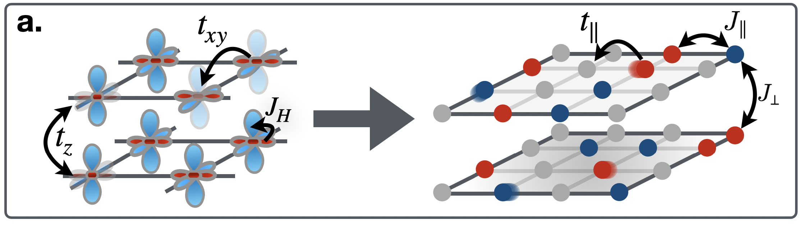

Code and data to the paper ["Simulating superconductivity in mixed-dimensional $t_\parallel$-$J_\parallel$-$J_\perp$ bilayers with neural quantum states"](https://arxiv.org/pdf/2602.10091)

Using Gutzwiller-projected Hidden Fermion Pfaffian States, we study the mixed-dimensional bilayer model, see below

